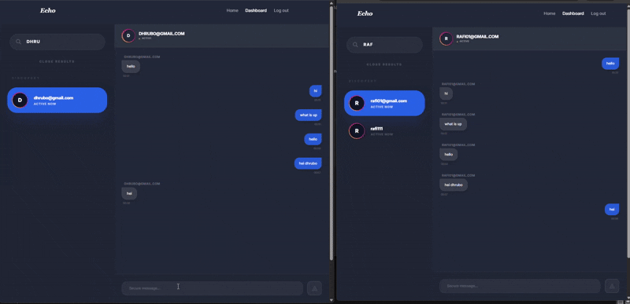

<div align="center">
  <h1>Echo</h1>
  <p><b>Return to your resonance.</b> A minimalist, high-performance real-time chat platform built for seamless digital communication.</p>

  
  
  
  
</div>

---

## 📸 Overview

> [!NOTE] 
> This project is optimized with Redis for lightning-fast authentication with Docker,without redis , the mongodb server will face more traffic and will be slower. It also embraces a minimalist, sleek design framework inspired by modern app aesthetics, ensuring a distraction-free user experience. 

<div align="center">
  
</div>

## ✨ Key Features

- **Real-Time Synergy:** Instant messaging capabilities powered by WebSockets.
- **Redis Caching:** High-performance login flow with user data cached in Redis to minimize database latency.
- **Sleek Aesthetic:** Pixel-perfect dark-mode UI customized via Tailwind CSS utility classes.
- **State Management:** Highly predictable client-side state handling via Redux Toolkit.
- **Secure Authentication:** Robust JWT-based authentication system preventing unauthorized data access.
- **Containerized Orchestration:** Seamless deployment using Docker and Docker Compose.

## 🛠️ Tech Stack

- **Frontend:** React, React Router Dom, Redux Toolkit, Tailwind CSS 
- **Backend:** Node.js, Express.js
- **Database:** MongoDB (Atlas)
- **Cache:** Redis (v7+)
- **Authentication:** JSON Web Tokens (JWT) & bcrypt

---

## 🚀 Quick Start

The easiest way to run Echo is using Docker Compose.

### 1. Using Docker Compose (Recommended)
```bash
# Clone the repository
git clone https://github.com/iftiarrafi/Echo-ChatApp.git
cd Echo

# Start the stack (Backend + Redis)
docker-compose up --build
```

### 2. Manual Installation
If you prefer running the components individually:
```bash
# Install backend dependencies
cd backend && npm install

# Install frontend dependencies
cd ../frontend && npm install

# Run the backend (Requires local Redis & MongoDB connection)
cd ../backend && npm start

# Run the frontend
cd ../frontend && npm start
```

---

## ⚡ Redis Implementation

Echo uses Redis to cache user login information for **1 hour**. 

- **Cache-First Strategy**: Upon login, the system checks Redis for user credentials before querying MongoDB.
- **Performance**: Reduces database load and speeds up authentication response times.
- **Automatic Expiry**: Cached user data and JWT tokens both expire after 1 hour to ensure security and data consistency.

---

## 🐳 Docker Orchestration

Echo is fully containerized. The `docker-compose.yml` file orchestrates the following services:

| Service | Image | Internal Port | External Port |
| ------- | ----- | ------------- | ------------- |
| `backend` | Custom Node.js (Alpine) | `3001` | `3001` |
| `redis` | `redis:7-alpine` | `6379` | `6379` |

> [!TIP]
> To run the backend in the background, use `docker-compose up -d`.

---

## ⚙️ Configuration

Set up these required variables in your `/backend/.env` file:

| Variable | Description | Example / Default |
| -------- | ----------- | ----------------- |
| `PORT` | API Server Port | `3001` |
| `MONGODB_URL` | MongoDB Connection String | `mongodb+srv://...` |
| `REDIS_URL` | Redis Connection String | `redis://redis:6379` |
| `JWT_SECRET` | Secret key for JWT hashing | `your_super_secret_key` |

---

## ⚖️ License

Distributed under the **MIT License**. See `LICENSE` for more information.
