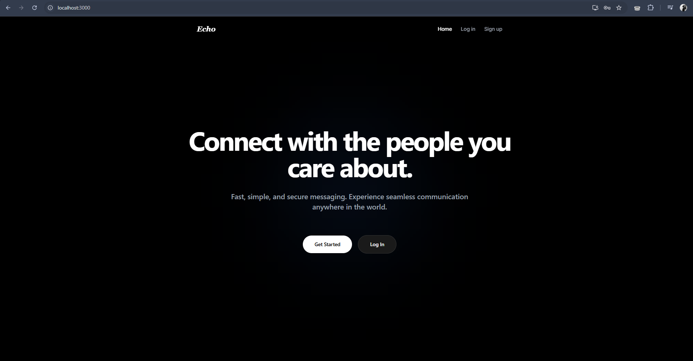

<div align="center">
  <h1>Echo</h1>
  <p><b>Return to your resonance.</b> A minimalist, high-performance real-time chat platform built for seamless digital communication.</p>

  
  
  
  
</div>

---

## 📸 Overview

> [!NOTE] 
> This project embraces a hyper-minimalist, sleek design framework inspired by modern app aesthetics, ensuring a distraction-free user experience.

<div align="center">
  
  
</div>

## ✨ Key Features

- **Real-Time Synergy:** Instant messaging capabilities powered by WebSockets.
- **Sleek Aesthetic:** Pixel-perfect dark-mode UI customized via Tailwind CSS utility classes.
- **State Management:** Highly predictable client-side state handling via Redux Toolkit.
- **Secure Authentication:** Robust JWT-based authentication system preventing unauthorized data access.
- **Modern Architecture:** Built on the reliable MERN stack for scalable, enterprise-grade application deployment.

## 🛠️ Tech Stack

- **Frontend:** React, React Router Dom, Redux Toolkit, Tailwind CSS 
- **Backend:** Node.js, Express.js
- **Database:** MongoDB
- **Authentication:** JSON Web Tokens (JWT) & bcrypt

---

## 🚀 Quick Start

Get Echo running locally in less than two minutes.

### 1. Clone & Install Dependencies
```bash
# Clone the repository
git clone https://github.com/iftiarrafi/Echo-ChatApp.git
cd Echo

# Install backend dependencies
cd backend && npm install

# Install frontend dependencies
cd ../frontend && npm install
```


> [!TIP]
> The frontend typically runs on `http://localhost:5173/` while the server runs on `http://localhost:3001/`. Make sure both ports are free.

---

## ⚙️ Configuration

Set up these required variables in your root `/backend/.env` file:

| Variable | Description | Example / Default |
| -------- | ----------- | ----------------- |
| `PORT` | API Server Port | `3001` |
| `MONGO_URI` | MongoDB Connection String | `mongodb+srv://...` |
| `JWT_SECRET` | Secret key for JWT hashing | `your_super_secret_key` |
| `NODE_ENV` | Application Environment | `development` |

---


## ⚖️ License

Distributed under the **MIT License**. See `LICENSE` for more information.
